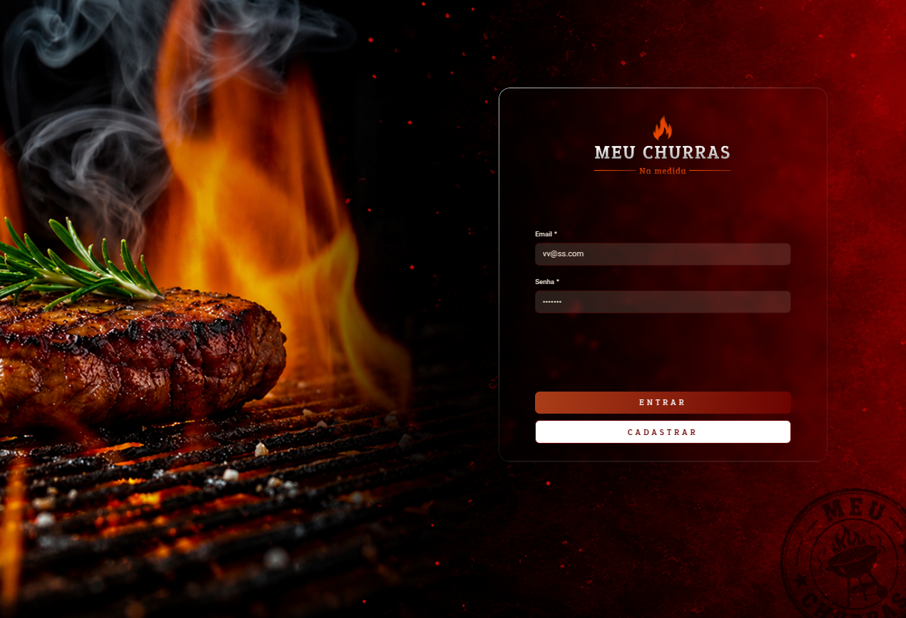
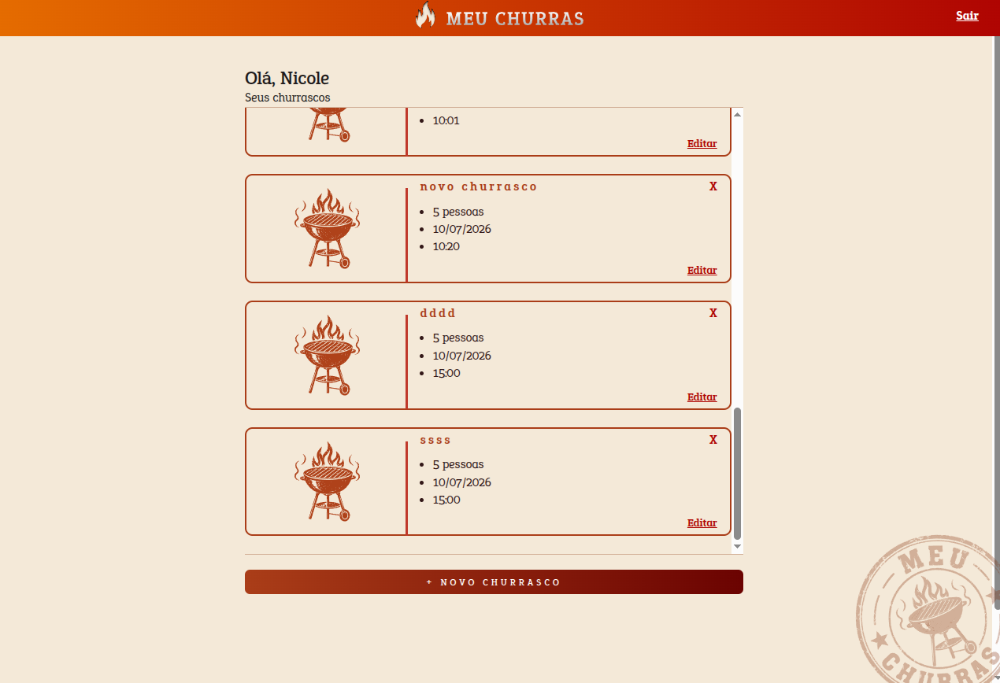

# 🔥 Meu Churras

  <b>Organize seus churrascos de forma simples e prática.</b>

---

## 📖 Sobre o projeto

O **Meu Churras** é uma aplicação web desenvolvida para facilitar a organização de churrascos.

A plataforma permite que usuários criem uma conta, realizem login de forma segura e gerenciem seus eventos, cadastrando churrascos, editando informações, removendo eventos e acompanhando todos os churrascos cadastrados em um único lugar.

O projeto foi desenvolvido utilizando **Angular** no frontend e **NestJS** no backend, com autenticação utilizando **JWT** e persistência de dados através do **Prisma ORM** e **PostgreSQL**.

---

## ✨ Funcionalidades

- ✅ Cadastro de usuários
- ✅ Login com autenticação JWT
- ✅ Logout
- ✅ Cadastro de churrascos
- ✅ Listagem de churrascos
- ✅ Edição de churrascos
- ✅ Exclusão de churrascos
- ✅ Visualização de comprovantes
- ✅ Interface responsiva
- ✅ Alertas utilizando SweetAlert2

---

## 📷 Demonstração

### Login

### Lista de churrascos

---

## 🛠 Tecnologias utilizadas

### Frontend

- Angular
- TypeScript
- SCSS
- RxJS
- SweetAlert2

### Backend

- NestJS
- Prisma ORM
- PostgreSQL
- JWT
- bcrypt
- Swagger

---

## 🚀 Próximas melhorias

- Cadastro de participantes
- Convites para eventos
- Controle de despesas
- Dashboard com estatísticas
- Recuperação de senha
- Perfil do usuário

---

## 👩‍💻 Desenvolvido por

**Nicole**
